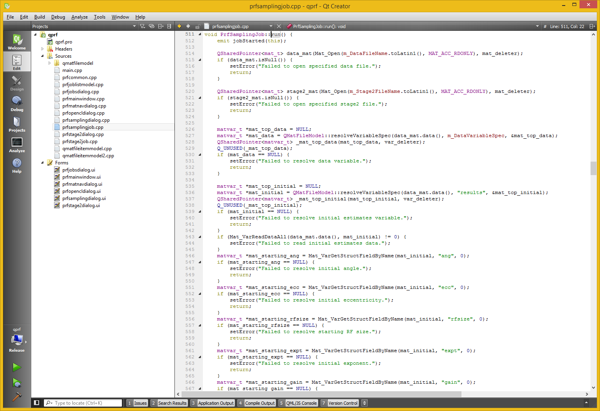

# qprf
QPrf - MCMC Sampler for population receptive fields

<strong>2012/12/20 As of today this repository finally contains the GPLv3-licensed source code of QPrf.</strong>
For now, please cite https://www.biorxiv.org/content/early/2017/12/14/233619 if you use it in your research. The paper is still under peer review at Neuroimage and we hope to publish it soon. Thank you in advance.

<strong>You can now find a pre-release https://github.com/sadaszewski/qprf/releases/tag/pre1 containing 32-bit application binary for Windows as well as sample simulated data in the examples/ folder.</strong>

This repository is currently a placeholder for my population receptive field (pRF) and Balloon-Windkessel hemodynamic joint posterior MCMC sampler (C++) and associated utilities (Python). Once we manage to publish the accompanying research paper ("Simultaneous Estimation of Population Receptive Field and Hemodynamic Parameters from Single Point BOLD Responses using Metropolis-Hastings Sampling") the GPLv3-licensed code will be made public here. We'd like to ask that the paper is cited if the code and/or binaries are used in your own (research) proceedings but it's not part of legal requirements of GPLv3. Be mindful of other requirements of GPLv3 however, most importantly - all derivatives that are made available to third parties must include the entire source code including your modifications and be made available under GPLv3. Please read legally binding licence text in the accompanying LICENSE file. Thank you in advance!

